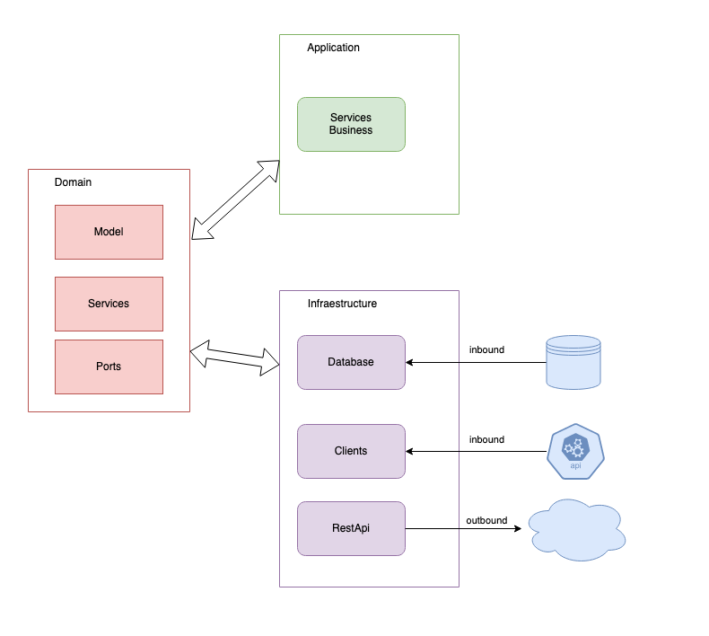
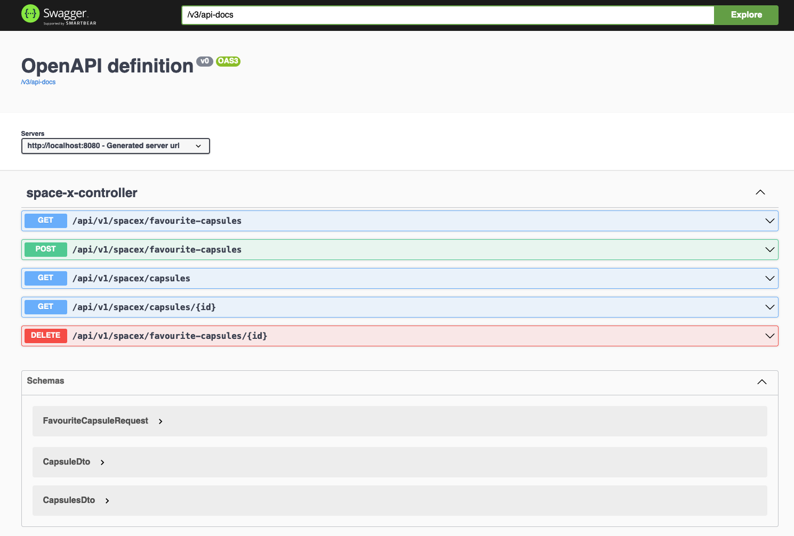

# hexagonal-architecture

This project is a sample for using a hexagonal architecture using Java with SpringBoot trying to use a good practices
like tests, clean code and modules

```xml

<dependency>
    <groupId>io.github.javialc.java</groupId>
    <artifactId>hexagonal-archiectecture</artifactId>
    <version>1.0.0</version>
</dependency>
```

## Structure

* **application:** Business application logic
* **domain:** Common DTOs and Ports to communicate application layer with infrastructure layer
* **infrastructure:**
  * **Database:** Configuration and repositories to connect with database. In this case a memory H2 database.
  * **Rest:** Configuration and definition of API rest
  * **SpaceXApi:** Configuration and definition of Client Rest to connect with SpaceX API




## Dependencies

| library                             | version |
|-------------------------------------|---------|
| Java SDK                            | 17      |
| Maven                               | 3.8.x+  |
| spring-boot-starter-parent          | 3.1.4   |
| springdoc-openapi-starter-webmvc-ui | 2.1.0   |

## Install and Run

The project has configured with Maven, so you need to have installed maven3.8+ and Java17+

To install and pass test execute:

```bash
  mvn clean install
```

To run microservice execute:

```bash
  mvn spring-boot:run
```


## OpenApi

OpenApi has configured into the project, and you can access with the endpoints

```
  http://localhost:8080/v3/api-docs
  http://localhost:8080/swagger-ui/index.html
```


